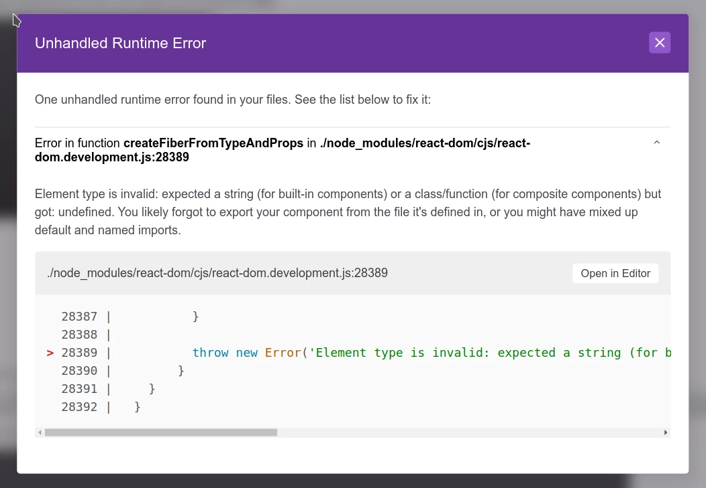

# Error demo only

This repo exists only to demo an error caused by using gatsby-source-wordpress with React 18.x

### Problem

React 18.x.x causes the gatsby-source-wordpress plugin to throw an error when a template uses post
content containg inline html `` elements.

When generating the site using gatsby develop and viewing a page containing inline images, this
error is thrown:

_"Error in function createFiberFromTypeAndProps in ./node_modules/react-dom/cjs/react-dom.development.js:28389"_

### To reproduce

Run `gatsby develop` and view the site (single page) to see the error.

### Workaround

Rollback to React "17.0.2".